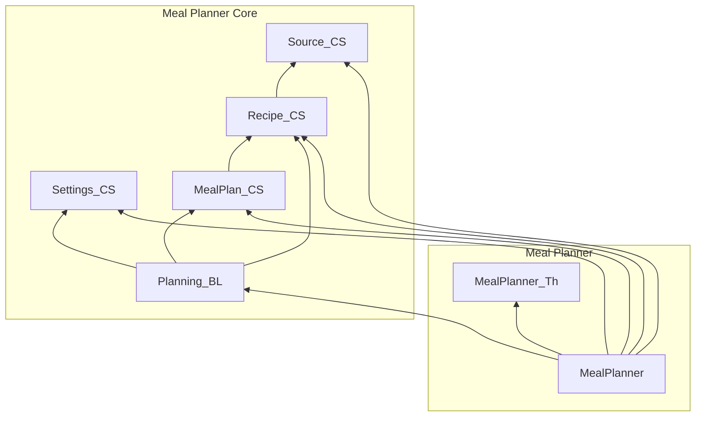

# Meal Planner — OutSystems 11 module plan

Greenfield Reactive Web application. Firestore and Firebase Authentication are not used. Business data lives in OutSystems entities and static entities. No data migration.

This plan follows the current Vue application, not the older README summary where the two differ. It also follows the OutSystems 11 Architecture Canvas: [Architecture](https://success.outsystems.com/documentation/11/app_architecture/), including [From architecture to development](https://success.outsystems.com/documentation/11/app_architecture/from_architecture_to_development/), [Validating your application architecture](https://success.outsystems.com/documentation/11/app_architecture/designing_the_architecture_of_your_outsystems_applications/validating_your_application_architecture/), and [The 4 Rules for Correct Application Composition](https://success.outsystems.com/documentation/11/app_architecture/designing_the_architecture_of_your_outsystems_applications/application_composition/the_4_rules_for_correct_application_composition/).

## What the application does

Two people share one household meal planner. Plans, recipes, sources, and settings are application-wide. They are not scoped to the logged-in user.

After login the user can:

- See today's calories, protein, carbs, fat, sodium, and sugar against daily targets, plus calorie totals for Breakfast, Lunch, Dinner, and Snacks.
- Open this week or next week from the dashboard. The meal-type cards navigate to a page that is still a placeholder.
- Review this week, next week, and the four previous weeks, then open a week and add, edit, or remove meal items.
- Keep a recipe library of homemade recipes and prepared foods. Search by keyword, category, cuisine, and calorie range.
- Maintain the list of places prepared food comes from.
- Set the week start day, daily nutrient ranges, a sugar maximum, and a tolerance percent used for color coding.

A meal item stores the recipe, a serving count, and a nutrition snapshot. Changing the recipe or the serving count proposes scaled nutrition. The user can override any nutrient before saving. Planned meals stay editable after the day has passed.

## Decisions

1. **Two applications, seven modules.** Same shape as the soccer-fields blueprint: one end-user application (screens plus theme) and one core application (entities and business rules). One owner and one sponsor, so the split is for lifecycle independence, not for Rule #3 or Rule #4.
2. **No Orchestration module.** OutSystems 11 treats screen destinations as weak references, and the Architecture Canvas no longer has an orchestration layer.
3. **No Firebase and no replacement AI.** The recipe generator is an unused experiment. "Calculate Nutrition" calls Firebase AI. Both are omitted. Nutrition is typed in. A future `Nutrition_IS` module can wrap a different provider without changing `Recipe_CS`.
4. **The unfinished dashboard drill-in stays unfinished.** The screen exists and says the page is under construction.
5. **Recipe delete is blocked when a meal item still points at the recipe.** The Vue app does not check this. The entity uses Delete Rule Protect so a logged meal cannot lose its recipe. The screen explains why delete failed.
6. **Source delete stays in the recipe module's public API.** `Recipe_CS` must reference `Source_CS`. If `Source_CS` also queried recipes, the two core modules would cycle. `Source_CS` only refuses to delete the protected Generic Restaurant row. `Recipe_CS` exposes the "delete if unused" action.
7. **Reads of core entities are public and read-only.** Writes go through public server actions in the owning module. Consumers do not write entities directly.
8. **Authentication is the platform Users module.** Registered users only. Business entities have no `UserId`.

## Applications

| Application       | Layer    | Why this layer                  | Modules                                                               |
| ----------------- | -------- | ------------------------------- | --------------------------------------------------------------------- |
| Meal Planner      | End-user | Top module is the screen module | `MealPlanner`, `MealPlanner_Th`                                       |
| Meal Planner Core | Core     | Top module is `Planning_BL`     | `Source_CS`, `Settings_CS`, `Recipe_CS`, `MealPlan_CS`, `Planning_BL` |

An application's layer is the topmost layer of its modules. The theme sits in the end-user application, matching the documented `SF_Th` placement. Core modules are not owned by the screen application, so the screens can change without redeploying the data model as the same unit.

## Canvas rules

- No upward references. Screens reference core and the theme. `Planning_BL` references core services. Core services do not reference `Planning_BL` or `MealPlanner`.
- No side reference between end-user modules. There is only one.
- No cycle among core modules. `Recipe_CS` references `Source_CS`. `MealPlan_CS` references `Recipe_CS`. Nothing references back.
- Join a concept when it is one lifecycle. Split when a second concept would create a cycle or a module that mixes configuration with daily transactions.

## Modules

Names use the convention from [From architecture to development](https://success.outsystems.com/documentation/11/app_architecture/from_architecture_to_development/): no suffix on the screen module, because that name is in the URL; `_CS` for a core service; `_BL` for business logic that composes several core concepts; `_Th` for the theme.

### MealPlanner_Th

|             |                                                     |
| ----------- | --------------------------------------------------- |
| Application | Meal Planner                                        |
| Layer       | Foundation                                          |
| Style       | Reactive Web theme module. No screens, no entities. |
| References  | OutSystems UI as the base theme                     |

Contents:

- Theme based on OutSystems UI.
- Styles for the five nutritional statuses: in-zone (green), low and high warning (amber), low and high danger (red).
- Nothing else. Menu, login, and screens belong to `MealPlanner`.

### Source_CS

|             |                      |
| ----------- | -------------------- |
| Application | Meal Planner Core    |
| Layer       | Core                 |
| References  | None in this factory |

A source is where a prepared food comes from (a restaurant, a delivery service, a grocery brand). It has its own screens and can exist before any recipe uses it.

**Entity `Source`**, public, expose read only:

| Attribute   | Type      | Notes                               |
| ----------- | --------- | ----------------------------------- |
| Name        | Text(100) | Required. Unique, case-insensitive. |
| IsProtected | Boolean   | True only for the bootstrap row.    |

**Bootstrap:** one row, Name `Generic Restaurant`, IsProtected True. It cannot be renamed or deleted.

**Public actions:**

- `Source_Create(Name)` — trim, require a name, reject a duplicate.
- `Source_Update(SourceId, Name)` — same checks. Reject when `IsProtected`.
- `Source_Delete(SourceId)` — reject when `IsProtected`. Does not look at recipes.

### Settings_CS

|             |                      |
| ----------- | -------------------- |
| Application | Meal Planner Core    |
| Layer       | Core                 |
| References  | None in this factory |

One application settings record. Not per user.

**Static entity `WeekDay`:** Sunday through Saturday, with `DayIndex` 0 through 6.

**Entity `ApplicationSetting`**, public, expose read only. The module guarantees exactly one row.

| Attribute        | Type               | Default |
| ---------------- | ------------------ | ------- |
| MinDailyCalories | Decimal            | 1950    |
| MaxDailyCalories | Decimal            | 2150    |
| MinDailyProtein  | Decimal            | 140     |
| MaxDailyProtein  | Decimal            | 160     |
| MinDailyCarbs    | Decimal            | 210     |
| MaxDailyCarbs    | Decimal            | 235     |
| MinDailyFat      | Decimal            | 60      |
| MaxDailyFat      | Decimal            | 75      |
| MinDailySodium   | Decimal            | 1500    |
| MaxDailySodium   | Decimal            | 2300    |
| MaxDailySugar    | Decimal            | 38      |
| Tolerance        | Decimal            | 10      |
| WeekStartDayId   | WeekDay Identifier | Sunday  |

**Public actions:**

- `ApplicationSetting_Get` — return the row, creating the default row first if it is missing.
- `ApplicationSetting_Update(...)` — update that row only. Do not insert a second row.

Validation: each minimum is required and positive and less than its maximum. Sugar maximum is required and positive. Tolerance is required and from 0 through 100 inclusive. Week start is required.

### Recipe_CS

|             |                   |
| ----------- | ----------------- |
| Application | Meal Planner Core |
| Layer       | Core              |
| References  | `Source_CS`       |

A recipe is anything eaten at a meal, including a simple food such as milk. Homemade recipes have ingredients and steps. Prepared recipes have a source and no ingredients or steps.

**Static entities:**

- `RecipeKind`: Homemade, Prepared.
- `RecipeDifficulty`: Easy, Normal, Advanced.
- `RecipeCategory`: Appetizer, Beverage, Breakfast, Bread, Grain, Pasta, Beef, Pork, Lamb, Poultry, Seafood, Vegetarian, Side Dish, Soup, Salad, Sauce, Dessert.
- `Cuisine`: American, Chinese, French, Greek, Indian, Italian, Japanese, Mediterranean, Mexican, Middle Eastern, Thai.
- `UnitType`: Weight, Volume, Quantity.
- `UnitSystem`: Metric, Customary, None.
- `UnitOfMeasure`: the rows below. `Code` is the short label shown in ingredient lists (`ml`, `tsp`, `cup`). `Label` is the full name.

| Code    | Label       | Type     | System    |
| ------- | ----------- | -------- | --------- |
| ml      | Milliliter  | Volume   | Metric    |
| l       | Liter       | Volume   | Metric    |
| tsp     | Teaspoon    | Volume   | Customary |
| tbsp    | Tablespoon  | Volume   | Customary |
| floz    | Fluid Ounce | Volume   | Customary |
| cup     | Cup         | Volume   | Customary |
| pint    | Pint        | Volume   | Customary |
| quart   | Quart       | Volume   | Customary |
| gallon  | Gallon      | Volume   | Customary |
| mg      | Milligram   | Weight   | Metric    |
| g       | Gram        | Weight   | Metric    |
| kg      | Kilogram    | Weight   | Metric    |
| oz      | Ounce       | Weight   | Customary |
| lb      | Pound       | Weight   | Customary |
| piece   | Piece       | Quantity | None      |
| item    | Item        | Quantity | None      |
| each    | Each        | Quantity | None      |
| pinch   | Pinch       | Quantity | None      |
| serving | Serving     | Quantity | None      |

**Entity `Recipe`**, public, expose read only:

| Attribute          | Type                        | Notes                                                          |
| ------------------ | --------------------------- | -------------------------------------------------------------- |
| Name               | Text(150)                   | Required. Unique, case-insensitive.                            |
| Description        | Text(2000)                  | Optional.                                                      |
| RecipeKindId       | RecipeKind Identifier       | Required.                                                      |
| SourceId           | Source Identifier           | Null for homemade. Required for prepared. Delete Rule Protect. |
| RecipeCategoryId   | RecipeCategory Identifier   | Required.                                                      |
| CuisineId          | Cuisine Identifier          | Required.                                                      |
| RecipeDifficultyId | RecipeDifficulty Identifier | Required. Prepared saves Easy.                                 |
| Servings           | Decimal                     | Required, positive.                                            |
| PrepTimeMinutes    | Integer                     | Required, zero or greater. Prepared saves 0.                   |
| CookTimeMinutes    | Integer                     | Required, zero or greater. Prepared saves 0.                   |
| Calories           | Decimal                     | Per serving. Required, zero or greater.                        |
| Sodium             | Decimal                     | Milligrams per serving.                                        |
| Sugar              | Decimal                     | Grams per serving.                                             |
| Carbs              | Decimal                     | Grams per serving.                                             |
| Fat                | Decimal                     | Grams per serving.                                             |
| Protein            | Decimal                     | Grams per serving.                                             |

**Entity `RecipeIngredient`**, public, expose read only. Delete Rule Delete when the recipe is deleted.

| Attribute       | Type                               |
| --------------- | ---------------------------------- |
| RecipeId        | Recipe Identifier, required        |
| Order           | Integer, required                  |
| Units           | Decimal, required, positive        |
| UnitOfMeasureId | UnitOfMeasure Identifier, required |
| Name            | Text(200), required                |

**Entity `RecipeStep`**, public, expose read only. Delete Rule Delete when the recipe is deleted.

| Attribute   | Type                        |
| ----------- | --------------------------- |
| RecipeId    | Recipe Identifier, required |
| Order       | Integer, required           |
| Instruction | Text(2000), required        |

**Public actions:**

- `Recipe_Create` and `Recipe_Update` replace the ingredient and step lists in full.
- Homemade: source is null; difficulty, prep, and cook are stored as entered; ingredients and steps are stored in the submitted order. An empty list is allowed.
- Prepared: source is required; difficulty is Easy; both times are 0; ingredients and steps are cleared.
- Name is trimmed. Duplicate names are rejected, ignoring case, excluding the recipe being updated.
- `Recipe_Get(RecipeId)` returns the recipe, ingredients, and steps.
- `Recipe_Delete(RecipeId)` deletes the recipe. The meal-plan foreign key is Protect, so a recipe that is still on a plan fails here. This action does not reference `MealPlan_CS`.
- `Recipe_Search(Keywords, CategoryId, CuisineId, MinCalories, MaxCalories)` — every whitespace-separated keyword must match the name, description, or an ingredient name, case-insensitive. Blank filters are ignored.
- `Source_DeleteIfUnused(SourceId)` — if any recipe uses the source, return a failure the screen can show. Otherwise call `Source_Delete`.

There is no kind filter on the recipe list. Do not add one.

### MealPlan_CS

|             |                   |
| ----------- | ----------------- |
| Application | Meal Planner Core |
| Layer       | Core              |
| References  | `Recipe_CS`       |

One plan per calendar date. A plan has up to four meals. A meal has one or more items.

**Static entity `MealType`:** Breakfast, Lunch, Dinner, Snack, with `SortOrder` 1 through 4.

**Entity `MealPlan`**, public, expose read only:

| Attribute | Type | Notes             |
| --------- | ---- | ----------------- |
| PlanDate  | Date | Required. Unique. |

**Entity `Meal`**, public, expose read only. Delete Rule Delete with the plan.

| Attribute  | Type                          |
| ---------- | ----------------------------- |
| MealPlanId | MealPlan Identifier, required |
| MealTypeId | MealType Identifier, required |

Unique on (`MealPlanId`, `MealTypeId`).

**Entity `MealItem`**, public, expose read only. Delete Rule Delete with the meal.

| Attribute                                    | Type                               | Notes                                                                       |
| -------------------------------------------- | ---------------------------------- | --------------------------------------------------------------------------- |
| MealId                                       | Meal Identifier, required          |                                                                             |
| RecipeId                                     | Recipe Identifier, required        | Delete Rule Protect.                                                        |
| Name                                         | Text(150), required                | Copied from the recipe at save. Not updated if the recipe is later renamed. |
| Servings                                     | Decimal, required, positive        |                                                                             |
| Calories, Sodium, Sugar, Carbs, Fat, Protein | Decimal, required, zero or greater | Snapshot for this item, not a live link to the recipe.                      |

**Public actions:**

- `MealPlan_GetByDate(PlanDate)`
- `MealPlan_GetForPeriod(StartDate, EndDate)` inclusive
- `MealPlan_RecipeIsUsed(RecipeId)` — true when any meal item points at the recipe
- `MealItem_Get(MealItemId)` — item plus its meal type and plan date
- `MealItem_Add(PlanDate, MealTypeId, RecipeId, Servings, Nutrition)` — create the plan and the meal when they do not exist, then add the item. Copy the recipe name. Store the nutrition the caller sends.
- `MealItem_Update(MealItemId, PlanDate, MealTypeId, RecipeId, Servings, Nutrition)` — same date and type updates the item. A different type or date removes it from the old meal and adds it to the destination, creating the destination plan or meal when needed. Delete a meal that has no items left. Delete a plan that has no meals left.
- `MealItem_Remove(MealItemId)` — remove the item, then the meal if it is empty, then the plan if it is empty.

Add, update, and remove each run as one server action so the plan cannot be left half-moved. They live here, not in `Planning_BL`, because the entities are expose-read-only and only the owner module can write them. The actions do not scale nutrition and do not read settings. The screen proposes nutrition with `Planning_BL`, then passes the snapshot in.

### Planning_BL

|             |                                           |
| ----------- | ----------------------------------------- |
| Application | Meal Planner Core                         |
| Layer       | Core                                      |
| References  | `Settings_CS`, `Recipe_CS`, `MealPlan_CS` |

This is the booking-style composition module. It is the only place that knows about plans, recipes, and settings together.

**Static entity `NutritionalStatus`:** InZone, LowWarn, LowDanger, HighWarn, HighDanger.

**Structure `Nutrition`:** Calories, Sodium, Sugar, Carbs, Fat, Protein, all Decimal.

**Structure `WeeklySummary`:** StartDate, EndDate, DaysWithMeals, and the six averages.

**Public actions and functions:**

- `Nutrition_RangeStatus(Value, Min, Max, Tolerance)` — null when any input is null. Otherwise:
  - `allowed = ((Max + Min) / 2) * (Max(Tolerance, 0) / 100)`
  - value inside min and max: InZone
  - below min but within `allowed`: LowWarn
  - above max but within `allowed`: HighWarn
  - further below: LowDanger
  - further above: HighDanger
- `Nutrition_MaxOnlyStatus(Value, Max, Tolerance)` — null when any input is null. `allowed = Max * (Max(Tolerance, 0) / 100)`. At or below max: InZone. Above max but within `allowed`: HighWarn. Otherwise HighDanger. Sugar uses this. The other five nutrients use the range function.
- `Nutrition_Scale(Nutrition, Factor)` — multiply each field by the factor.
- `Nutrition_ForServings(RecipeId, Servings)` — recipe per-serving nutrition multiplied by servings.
- `MealPlan_DailyNutrition(PlanDate)` — sum of item snapshots. A day with no plan returns zeros.
- `Planning_WeekRange(ReferenceDate)` — week start and end from `ApplicationSetting.WeekStartDay`. Seven days, end inclusive.
- `Planning_WeeklySummary(WeekStartDate)` — load plans from that start through the next six days. `DaysWithMeals` counts plans that have at least one meal. Averages are the sums divided by `DaysWithMeals`, or by 1 when that count is 0, then rounded to the nearest integer.

`Planning_BL` does not create, move, or delete meal items.

### MealPlanner

|             |                                                                                                                           |
| ----------- | ------------------------------------------------------------------------------------------------------------------------- |
| Application | Meal Planner                                                                                                              |
| Layer       | End-user                                                                                                                  |
| Style       | Reactive Web. Anonymous only on Login and the invalid-link screen. Every other screen requires Registered.                |
| References  | `MealPlanner_Th` as its base theme, plus `Planning_BL`, `Recipe_CS`, `MealPlan_CS`, `Settings_CS`, `Source_CS`, and Users |

No business entities. No copied business rules. Screens call the public actions above.

Menu:

- Dashboard
- Planning & Logging
- Recipes
- Settings
- Recipe Sources
- Logout

Desktop shows a side menu. Phone shows a menu that can be opened and closed. Both reach the same screens.

| Screen           | Role       | Behavior                                                                                                                                                                                                                                                                                                                                                                                        |
| ---------------- | ---------- | ----------------------------------------------------------------------------------------------------------------------------------------------------------------------------------------------------------------------------------------------------------------------------------------------------------------------------------------------------------------------------------------------- |
| Login            | Anonymous  | Email and password. Failure: "Login failed. Please try again." Success opens Dashboard. Forgot password sends the Users reset and shows the success text from the Vue login page, or "Failed to send password reset email. Please try again."                                                                                                                                                   |
| InvalidLink      | Anonymous  | Title "I find this failure to load to be disturbing." Subtitle "This is not the page you are looking for."                                                                                                                                                                                                                                                                                      |
| Dashboard        | Registered | Today's six nutrients with status markers. Four meal cards showing that meal's calories, or "N/A", linking to DashboardRecipes. This week and next week summary cards link to the week screen.                                                                                                                                                                                                  |
| DashboardRecipes | Registered | The text "The meal recipes page is under construction. Please check back later."                                                                                                                                                                                                                                                                                                                |
| Planning         | Registered | This week, next week, then the four previous weeks. Card title for an older week is "Weeks Ago: N". Each card opens the week screen.                                                                                                                                                                                                                                                            |
| Week             | Registered | Input `WeekStartDate`. Missing or invalid input opens InvalidLink. Seven day cards. Each filled meal lists item name, a nutrition tooltip, edit, and delete. Delete asks "Are you sure you want to delete this item from the meal?" Empty day: "No meals have been entered". Close goes back. Add opens the add screen for this week.                                                           |
| MealItemAdd      | Registered | Input `WeekStartDate`. Date choices are the seven days of that week. Meal type, recipe, servings, and the six nutrients. Choosing a recipe sets nutrition to per-serving times servings. Changing servings scales the current nutrition by new/old. Save stays disabled until the form is valid. Cancel returns to the week.                                                                    |
| MealItemEdit     | Registered | Same form, loaded from the item. Save stays disabled until something changed and the form is valid. Changing the date or meal type moves the item.                                                                                                                                                                                                                                              |
| Recipes          | Registered | Keyword, category, cuisine, and calorie range filters. Ranges are 0–500, 501–750, 751–1000, and 1001+. Show "Displaying X of Y recipes". Empty library: "No recipes found." No matches: "No recipes match your search criteria." Cards show name, category, cuisine, difficulty, description, servings, prep plus cook minutes, and calories. Add opens the type choice.                        |
| RecipeType       | Registered | Homemade: "Simple to complex, some assembly is required." Prepared: "Premade meals from a delivery service or restaurant."                                                                                                                                                                                                                                                                      |
| RecipeDetail     | Registered | Name, description, cuisine, category, difficulty, servings, prep, cook, ingredients, steps, and per-serving nutrition. Ingredient unit `item` is omitted from the text; every other unit shows its code. Close, edit, and delete. Delete asks "Are you sure you want to delete {name}?" If the recipe is on a plan, say it cannot be deleted.                                                   |
| RecipeEdit       | Registered | Used for create homemade, create prepared, and update. Homemade shows difficulty, prep, cook, ingredients, and steps. Prepared shows a required source instead of difficulty, and hides times, ingredients, and steps. Name is required and unique. Category, cuisine, and servings are required. Nutrition is manual. No Calculate Nutrition button. Cancel returns to the list or the detail. |
| Sources          | Registered | List of source names. Generic Restaurant has no delete. Delete of a used source shows "This source is used in recipes and cannot be deleted." Otherwise confirm "Are you sure you want to delete {name}?" If recipes fail to load, show "Recipes have failed to load, deletion of sources is disabled" and hide delete. Empty list: "No sources found".                                         |
| SourceEdit       | Registered | Name required and unique. Save disabled until valid and, on update, changed.                                                                                                                                                                                                                                                                                                                    |
| Settings         | Registered | Title from the module description plus version site properties. The same fields as `ApplicationSetting`. Reset restores the values from when the screen loaded. Save calls `ApplicationSetting_Update`.                                                                                                                                                                                         |

Week and summary cards show the date range and color the six nutrients. A day title tooltip shows the day's nutrition when the day has at least one meal.

## Explicitly not a module

| Omitted                              | Reason                                                                                                |
| ------------------------------------ | ----------------------------------------------------------------------------------------------------- |
| `_CW` widget module                  | The screen module can hold the blocks. The soccer-fields blueprint skipped `_CW` for the same reason. |
| `_IS`, `_Sync`, `_API`               | No external system in this version.                                                                   |
| `_Eng`                               | The nutrition rules are not a separately versioned engine. They live in `Planning_BL`.                |
| `_Lib`                               | Units and categories are recipe vocabulary, not a business-agnostic library.                          |
| Per-user clones of plans or settings | The product is one shared household.                                                                  |
| Mobile app                           | The current product is a responsive web app. One Reactive module covers phone and desktop.            |

## Implementation order

Publish each module and refresh consumers before starting a module that references it.

1. `MealPlanner_Th`
2. `Source_CS`
3. `Settings_CS`
4. `Recipe_CS`
5. `MealPlan_CS`
6. `Planning_BL`
7. `MealPlanner`

`Source_CS` and `Settings_CS` do not depend on each other. They are sequenced only so a person reviews one module at a time.
