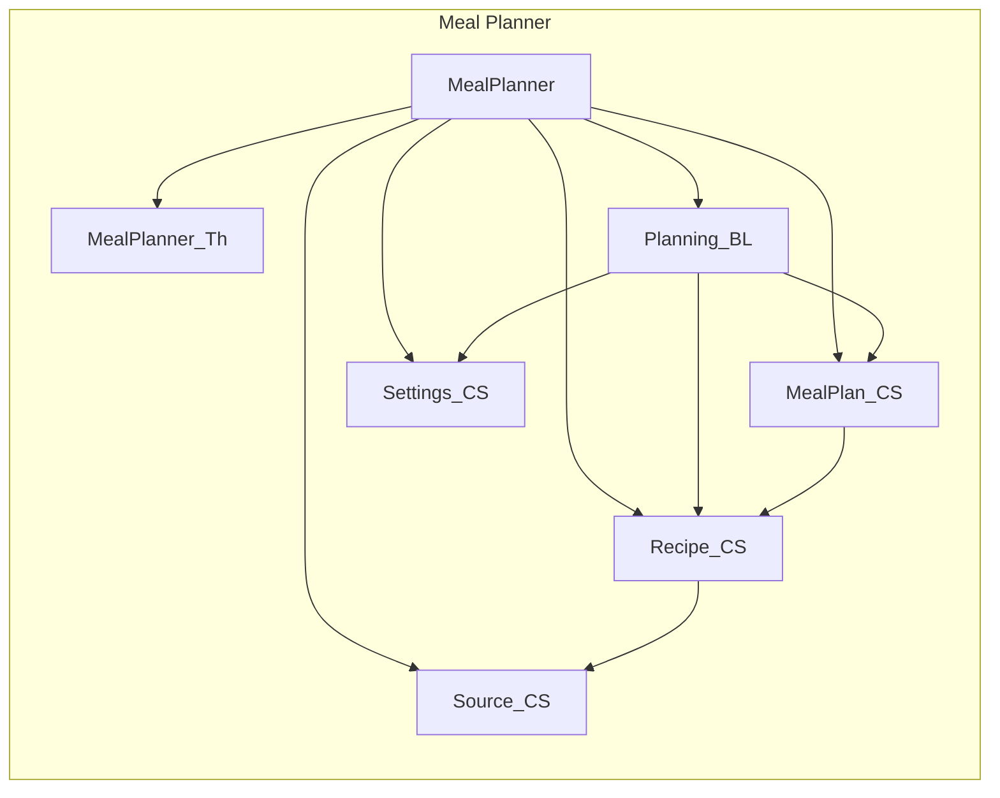

# Meal Planner — OutSystems 11 module plan

Greenfield Reactive Web application. Firestore and Firebase Authentication are not used. Business data lives in OutSystems entities and static entities. No data migration.

Where the README and the Vue code disagree, this plan follows the code. The recipe categories, the separate prep and cook times, the min/max nutrient ranges, and the sugar maximum all come from the code.

This plan follows the OutSystems 11 Architecture Canvas: [The Architecture Canvas](https://success.outsystems.com/documentation/11/app_architecture/designing_the_architecture_of_your_outsystems_applications/the_architecture_canvas/), [Validating your application architecture](https://success.outsystems.com/documentation/11/app_architecture/designing_the_architecture_of_your_outsystems_applications/validating_your_application_architecture/), [Applying the Architecture Canvas to applications](https://success.outsystems.com/documentation/11/app_architecture/designing_the_architecture_of_your_outsystems_applications/application_composition/applying_the_architecture_canvas_to_applications/), [The 4 Rules for Correct Application Composition](https://success.outsystems.com/documentation/11/app_architecture/designing_the_architecture_of_your_outsystems_applications/application_composition/the_4_rules_for_correct_application_composition/), [From architecture to development](https://success.outsystems.com/documentation/11/app_architecture/from_architecture_to_development/), and [Use Services to Expose Functionality](https://success.outsystems.com/documentation/11/building_apps/reusing_and_refactoring/use_services_to_expose_functionality/).

## What the application does

Two people share one household meal planner. Plans, recipes, sources, and settings are application-wide. They are not scoped to the logged-in user.

After login the user can:

- See today's protein, sugar, carbs, sodium, fat, and calories against daily targets, plus calorie totals for Breakfast, Lunch, Dinner, and Snacks.
- Open this week or next week from the dashboard. The meal-type cards navigate to a page that is still a placeholder. The link carries the meal type, and the placeholder ignores it.
- Review this week, next week, and the four previous weeks, then open a week and add, edit, or remove meal items.
- Keep a recipe library of homemade recipes and prepared foods. Search by keyword, category, cuisine, and calorie range.
- Maintain the list of places prepared food comes from. One bootstrapped source, Generic Restaurant, cannot be deleted. Its name can be changed.
- Set the week start day, daily nutrient ranges, a sugar maximum, and a tolerance percent used for color coding.

A meal item stores the recipe name at save time, a serving count, and a nutrition snapshot. Choosing a recipe proposes nutrition from the recipe's per-serving values times the servings. Changing the servings scales the values currently on the form. The user can override any nutrient before saving. Planned meals stay editable after the day has passed.

## Decisions

1. **One application, seven modules.** [Applying the Architecture Canvas to applications](https://success.outsystems.com/documentation/11/app_architecture/designing_the_architecture_of_your_outsystems_applications/application_composition/applying_the_architecture_canvas_to_applications/) says a first project starts as one application, and an end-user application may contain core modules when those modules are consumed only inside that application. A separate core application is the later step, used when a second end-user would otherwise reference the first. This product has one consumer. There is also one owner and one sponsor, so Rules #3 and #4 do not split it. In the [Soccer Fields sample](https://success.outsystems.com/documentation/11/app_architecture/from_architecture_to_development/developing_from_the_architecture_blueprint/), `Player_CS` and `Booking_BL` are created inside the end-user application. The separate core application exists there because field data comes from an external system. Meal Planner has no external system.
2. **No Orchestration module.** In OutSystems 11, screen destinations are weak references, and the Architecture Canvas no longer has an orchestration layer.
3. **Service modules, public Server Actions.** [Reusing and Refactoring](https://success.outsystems.com/documentation/11/building_apps/reusing_and_refactoring/) defines Service as the module type that encapsulates a core service. A Service module has no Interface tab, no client logic, no session variables, and no local storage. [Use Services to Expose Functionality](https://success.outsystems.com/documentation/11/building_apps/reusing_and_refactoring/use_services_to_expose_functionality/) says a small service with one consumer and the same release cycle exposes public Server Actions. A Server Action runs in the caller's process and transaction. Service Actions are the later choice for a large portfolio whose consumers release independently. Moving a meal item must stay in one transaction, so these modules expose Server Actions.
4. **No Firebase and no replacement AI.** Calculate Nutrition calls Firebase AI. The recipe generator is an unused experiment. Both are omitted. Nutrition is typed in.
5. **The unfinished dashboard drill-in stays unfinished.** The screen exists and says the page is under construction. The meal card still passes the meal type on the link.
6. **Recipe delete is blocked when a meal item still points at the recipe.** The Vue app deletes without that check. The entity uses Delete Rule Protect so a logged meal cannot lose its recipe. The screen explains why delete failed.
7. **Source delete stays in the recipe module's public API.** `Recipe_CS` references `Source_CS`. If `Source_CS` also queried recipes, the two modules would cycle. `Source_CS` only refuses to delete the protected Generic Restaurant row. `Recipe_CS` exposes the "delete if unused" action. Renaming Generic Restaurant is allowed. The Vue screen blocks delete by record identity, not by the current name.
8. **Reads of business entities are public and read-only.** Writes go through public server actions in the owning module. Consumers do not write those entities directly.
9. **Authentication is the platform Users module.** Registered users only. Business entities have no `UserId`.

## Application

| Application  | Layer    | Why this layer              | Modules                                                                                                |
| ------------ | -------- | --------------------------- | ------------------------------------------------------------------------------------------------------ |
| Meal Planner | End-user | Top module is `MealPlanner` | `MealPlanner_Th`, `MealPlanner`, `Source_CS`, `Settings_CS`, `Recipe_CS`, `MealPlan_CS`, `Planning_BL` |

An application's layer is the topmost layer of its modules. The theme and the core modules sit in this application because nothing else consumes them. The theme is Foundation. The `_CS` and `_BL` modules are Core. `MealPlanner` is End-user, so the application is End-user.

## Canvas rules

- No upward references. `MealPlanner` references the theme and the core modules. `Planning_BL` references the core services. The core services do not reference `Planning_BL` or `MealPlanner`.
- No side reference between end-user modules. There is only one.
- No cycle among core modules. `Recipe_CS` references `Source_CS`. `MealPlan_CS` references `Recipe_CS`. Nothing references back.

## Modules

Names follow [From architecture to development](https://success.outsystems.com/documentation/11/app_architecture/from_architecture_to_development/): no suffix on the screen module, because that name is in the URL; `_CS` for a core service; `_BL` for business logic that composes several core concepts; `_Th` for the theme.

Module type comes from [Reusing and Refactoring](https://success.outsystems.com/documentation/11/building_apps/reusing_and_refactoring/). A theme is a Reactive Web module. A module with only server-side elements is a Service module.

### MealPlanner_Th

|             |                                                    |
| ----------- | -------------------------------------------------- |
| Application | Meal Planner                                       |
| Layer       | Foundation                                         |
| Type        | Reactive Web. Theme only. No screens, no entities. |
| References  | OutSystems UI as the base theme                    |

[Isolating an application Theme](https://success.outsystems.com/documentation/11/app_architecture/designing_the_architecture_of_your_outsystems_applications/application_composition/isolating_an_application_theme/) says a theme module is restricted to look and feel. This application is not a shared portal, so login and the menu stay in `MealPlanner`. The Soccer Fields sample likewise removes the theme module's screen flow and puts screens in the front-end module.

Contents:

- Theme based on OutSystems UI.
- Styles for the five nutritional statuses: in-zone (green), low-warn and high-warn (amber), low-danger and high-danger (red).
- Nothing else.

### Source_CS

|             |              |
| ----------- | ------------ |
| Application | Meal Planner |
| Layer       | Core         |
| Type        | Service      |
| References  | None         |

A source is where a prepared food comes from. It has its own screens and can exist before any recipe uses it.

**Entity `Source`**, public, expose read only:

| Attribute   | Type      | Notes                                                |
| ----------- | --------- | ---------------------------------------------------- |
| Name        | Text(100) | Required. Unique, case-insensitive.                  |
| IsProtected | Boolean   | True only for the bootstrap row. Delete is rejected. |

**Bootstrap:** one row, Name `Generic Restaurant`, IsProtected True. A timer runs when the module is published and inserts that row only when it is missing. The name can be changed later. Delete is rejected while IsProtected is True, with the message "This source cannot be deleted."

**Public server actions**, each with a success flag and a user-facing message:

- `Source_Create(Name)` — trim, require a name, reject a duplicate, ignoring case.
- `Source_Update(SourceId, Name)` — same name rules. IsProtected does not block the rename.
- `Source_Delete(SourceId)` — reject when IsProtected is True. Does not look at recipes.

### Settings_CS

|             |              |
| ----------- | ------------ |
| Application | Meal Planner |
| Layer       | Core         |
| Type        | Service      |
| References  | None         |

One application settings record. Not per user.

**Static entity `WeekDay`:** Sunday through Saturday, with `DayIndex` 0 through 6.

**Entity `ApplicationSetting`**, public, expose read only. The module guarantees exactly one row.

| Attribute        | Type               | Default |
| ---------------- | ------------------ | ------- |
| MinDailyCalories | Decimal            | 1950    |
| MaxDailyCalories | Decimal            | 2150    |
| MinDailyProtein  | Decimal            | 140     |
| MaxDailyProtein  | Decimal            | 160     |
| MinDailyCarbs    | Decimal            | 210     |
| MaxDailyCarbs    | Decimal            | 235     |
| MinDailyFat      | Decimal            | 60      |
| MaxDailyFat      | Decimal            | 75      |
| MinDailySodium   | Decimal            | 1500    |
| MaxDailySodium   | Decimal            | 2300    |
| MaxDailySugar    | Decimal            | 38      |
| Tolerance        | Decimal            | 10      |
| WeekStartDayId   | WeekDay Identifier | Sunday  |

**Public server actions:**

- `ApplicationSetting_Get` — return the row, creating the default row first if it is missing. If more than one row exists, return the oldest and do not create another.
- `ApplicationSetting_Update(...)` — update that row only. Do not insert a second row.

Validation, with a specific message for the first failure:

- Each minimum and each maximum, including sugar, is positive.
- Each minimum is less than its matching maximum.
- Tolerance is from 0 through 100 inclusive.
- Week start is a real WeekDay.

### Recipe_CS

|             |              |
| ----------- | ------------ |
| Application | Meal Planner |
| Layer       | Core         |
| Type        | Service      |
| References  | `Source_CS`  |

A recipe is anything eaten at a meal, including a simple food such as milk. Homemade recipes have ingredients and steps. Prepared recipes have a source and no ingredients or steps.

**Static entities:**

- `RecipeKind`: Homemade, Prepared.
- `RecipeDifficulty`: Easy, Normal, Advanced.
- `RecipeCategory`: Appetizer, Beverage, Breakfast, Bread, Grain, Pasta, Beef, Pork, Lamb, Poultry, Seafood, Vegetarian, Side Dish, Soup, Salad, Sauce, Dessert.
- `Cuisine`: American, Chinese, French, Greek, Indian, Italian, Japanese, Mediterranean, Mexican, Middle Eastern, Thai.
- `UnitType`: Weight, Volume, Quantity.
- `UnitSystem`: Metric, Customary, None.
- `UnitOfMeasure`: the rows below. `Code` is the short label shown in ingredient lists (`ml`, `tsp`, `cup`). `Label` is the full name.

| Code    | Label       | Type     | System    |
| ------- | ----------- | -------- | --------- |
| ml      | Milliliter  | Volume   | Metric    |
| l       | Liter       | Volume   | Metric    |
| tsp     | Teaspoon    | Volume   | Customary |
| tbsp    | Tablespoon  | Volume   | Customary |
| floz    | Fluid Ounce | Volume   | Customary |
| cup     | Cup         | Volume   | Customary |
| pint    | Pint        | Volume   | Customary |
| quart   | Quart       | Volume   | Customary |
| gallon  | Gallon      | Volume   | Customary |
| mg      | Milligram   | Weight   | Metric    |
| g       | Gram        | Weight   | Metric    |
| kg      | Kilogram    | Weight   | Metric    |
| oz      | Ounce       | Weight   | Customary |
| lb      | Pound       | Weight   | Customary |
| piece   | Piece       | Quantity | None      |
| item    | Item        | Quantity | None      |
| each    | Each        | Quantity | None      |
| pinch   | Pinch       | Quantity | None      |
| serving | Serving     | Quantity | None      |

**Entity `Recipe`**, public, expose read only. Unique index on Name.

| Attribute          | Type                        | Notes                                                          |
| ------------------ | --------------------------- | -------------------------------------------------------------- |
| Name               | Text(150)                   | Required. Unique, case-insensitive.                            |
| Description        | Text(2000)                  | Optional.                                                      |
| RecipeKindId       | RecipeKind Identifier       | Required.                                                      |
| SourceId           | Source Identifier           | Null for homemade. Required for prepared. Delete Rule Protect. |
| RecipeCategoryId   | RecipeCategory Identifier   | Required.                                                      |
| CuisineId          | Cuisine Identifier          | Required.                                                      |
| RecipeDifficultyId | RecipeDifficulty Identifier | Required. Prepared saves Easy.                                 |
| Servings           | Decimal                     | Required.                                                      |
| PrepTimeMinutes    | Integer                     | Required, zero or greater. Prepared saves 0.                   |
| CookTimeMinutes    | Integer                     | Required, zero or greater. Prepared saves 0.                   |
| Calories           | Decimal                     | Per serving. Required.                                         |
| Sodium             | Decimal                     | Milligrams per serving. Required.                              |
| Sugar              | Decimal                     | Grams per serving. Required.                                   |
| Carbs              | Decimal                     | Grams per serving. Required.                                   |
| Fat                | Decimal                     | Grams per serving. Required.                                   |
| Protein            | Decimal                     | Grams per serving. Required.                                   |

**Entity `RecipeIngredient`**, public, expose read only. Delete Rule Delete when the recipe is deleted.

| Attribute       | Type                               |
| --------------- | ---------------------------------- |
| RecipeId        | Recipe Identifier, required        |
| Order           | Integer, required                  |
| Units           | Decimal, required                  |
| UnitOfMeasureId | UnitOfMeasure Identifier, required |
| Name            | Text(200), required                |

**Entity `RecipeStep`**, public, expose read only. Delete Rule Delete when the recipe is deleted.

| Attribute   | Type                        |
| ----------- | --------------------------- |
| RecipeId    | Recipe Identifier, required |
| Order       | Integer, required           |
| Instruction | Text(2000), required        |

**Public server actions:**

- `Recipe_Create` and `Recipe_Update` replace the ingredient and step lists in full.
- Homemade: source is null; difficulty, prep, and cook are stored as entered; ingredients and steps are stored in the submitted order. Skip an ingredient that has no units, no unit, or a blank name. Skip a step with a blank instruction. An empty list is allowed.
- Prepared: source is required and must exist; difficulty is Easy; both times are 0; ingredients and steps are cleared.
- Name is trimmed. A blank name is rejected. Duplicate names are rejected, ignoring case, excluding the recipe being updated. The duplicate message is `"{name}" already exists`.
- Category, cuisine, kind, and servings are required. Prep and cook are required and zero or greater for a homemade recipe. The six nutrients are required.
- `Recipe_Get(RecipeId)` returns the recipe, ingredients ordered by Order, and steps ordered by Order. Return a clear failure when the id does not exist.
- `Recipe_Delete(RecipeId)` deletes the recipe. The meal-plan foreign key is Protect, so a recipe that is still on a plan fails here with "This recipe is used in a meal plan and cannot be deleted." This action does not reference `MealPlan_CS`.
- `Recipe_Search(Keywords, CategoryId, CuisineId, MinCalories, MaxCalories)` — every whitespace-separated keyword must match the name, the description, or an ingredient name, case-insensitive. A null filter is ignored. Calorie bounds apply to the recipe's per-serving calories. Do not filter by kind.
- `Source_DeleteIfUnused(SourceId)` — if any recipe uses the source, return success false and "This source is used in recipes and cannot be deleted." Otherwise call `Source_Delete`.

There is no Calculate Nutrition action and no external API.

### MealPlan_CS

|             |              |
| ----------- | ------------ |
| Application | Meal Planner |
| Layer       | Core         |
| Type        | Service      |
| References  | `Recipe_CS`  |

One plan per calendar date. A plan has meals. A meal has one or more items. The week screen shows meals in stored order.

**Static entity `MealType`:** Breakfast, Lunch, Dinner, Snack. The dashboard label for Snack is Snacks.

**Entity `MealPlan`**, public, expose read only:

| Attribute | Type | Notes             |
| --------- | ---- | ----------------- |
| PlanDate  | Date | Required. Unique. |

**Entity `Meal`**, public, expose read only. Delete Rule Delete with the plan.

| Attribute  | Type                          |
| ---------- | ----------------------------- |
| MealPlanId | MealPlan Identifier, required |
| MealTypeId | MealType Identifier, required |

Unique on (`MealPlanId`, `MealTypeId`).

**Entity `MealItem`**, public, expose read only. Delete Rule Delete with the meal.

| Attribute                                    | Type                        | Notes                                                                       |
| -------------------------------------------- | --------------------------- | --------------------------------------------------------------------------- |
| MealId                                       | Meal Identifier, required   |                                                                             |
| RecipeId                                     | Recipe Identifier, required | Delete Rule Protect.                                                        |
| Name                                         | Text(150), required         | Copied from the recipe at save. Not updated if the recipe is later renamed. |
| Servings                                     | Decimal, required, positive |                                                                             |
| Calories, Sodium, Sugar, Carbs, Fat, Protein | Decimal, required           | Snapshot for this item, not a live link to the recipe.                      |

**Public server actions:**

- `MealPlan_GetByDate(PlanDate)` — the plan, its meals, and its items. An empty result when that date has no plan.
- `MealPlan_GetForPeriod(StartDate, EndDate)` — the same shape for every plan whose PlanDate is inside the inclusive range.
- `MealPlan_RecipeIsUsed(RecipeId)` — true when any meal item points at the recipe.
- `MealItem_Get(MealItemId)` — the item, its MealTypeId, and its PlanDate, or a failure when it does not exist.
- `MealItem_Add(PlanDate, MealTypeId, RecipeId, Servings, Nutrition)` — create the plan and the meal when they do not exist, then add the item. Copy the recipe name. Store the nutrition the caller sends. Do not rescale it.
- `MealItem_Update(MealItemId, PlanDate, MealTypeId, RecipeId, Servings, Nutrition)` — same date and type updates the item. A different type or date creates or reuses the destination plan and meal, creates the item there, and deletes the original. Then delete a meal that has no items, and delete a plan that has no meals. Do not clean up the destination.
- `MealItem_Remove(MealItemId)` — delete the item, then the meal if it is empty, then the plan if it is empty.

Add, update, and remove each run as one server action so a move cannot leave two copies or an empty plan behind. They live here, not in `Planning_BL`, because the entities are expose-read-only and only the owner module can write them. The actions do not read settings.

### Planning_BL

|             |                                           |
| ----------- | ----------------------------------------- |
| Application | Meal Planner                              |
| Layer       | Core                                      |
| Type        | Service                                   |
| References  | `Settings_CS`, `Recipe_CS`, `MealPlan_CS` |

This is the composition module. It is the only place that reads plans, recipes, and settings together. It does not create, move, or delete meal items.

**Static entity `NutritionalStatus`:** InZone, LowWarn, LowDanger, HighWarn, HighDanger.

**Structure `Nutrition`:** Calories, Sodium, Sugar, Carbs, Fat, Protein, all Decimal.

**Structure `WeeklySummary`:** StartDate, EndDate, DaysWithMeals, and the six averages.

**Public actions and functions:**

- `Nutrition_RangeStatus(Value, Min, Max, Tolerance)` — null when any input is null. Otherwise:
  - `allowed = ((Max + Min) / 2) * (Max(Tolerance, 0) / 100)`
  - value from Min through Max inclusive: InZone
  - below Min but at least Min minus allowed: LowWarn
  - above Max but at most Max plus allowed: HighWarn
  - further below: LowDanger
  - further above: HighDanger
- `Nutrition_MaxOnlyStatus(Value, Max, Tolerance)` — null when any input is null. `allowed = Max * (Max(Tolerance, 0) / 100)`. At or below Max: InZone. Above Max but within allowed: HighWarn. Otherwise HighDanger. Sugar uses this. The other five nutrients use the range function.
- `Nutrition_Scale(Nutrition, Factor)` — multiply each field by the factor.
- `Nutrition_ForServings(RecipeId, Servings)` — recipe per-serving nutrition multiplied by servings. Fail when the recipe does not exist or servings is not positive.
- `MealPlan_DailyNutrition(PlanDate)` — sum of item snapshots. A date with no plan returns zeros.
- `Planning_WeekRange(ReferenceDate)` — week start and end from `ApplicationSetting.WeekStartDay`. Seven days. End date is start plus 6 days.
- `Planning_WeeklySummary(WeekStartDate)` — load plans from that start through the next six days. `DaysWithMeals` counts plans that contain at least one meal. Averages are the sums divided by `DaysWithMeals`, or by 1 when that count is 0, then rounded to the nearest integer.

### MealPlanner

|             |                                                                                                                           |
| ----------- | ------------------------------------------------------------------------------------------------------------------------- |
| Application | Meal Planner                                                                                                              |
| Layer       | End-user                                                                                                                  |
| Type        | Reactive Web. Anonymous only on Login and InvalidLink. Every other screen requires Registered.                            |
| References  | `MealPlanner_Th` as its base theme, plus `Planning_BL`, `Recipe_CS`, `MealPlan_CS`, `Settings_CS`, `Source_CS`, and Users |

No business entities. Screens call the public actions above.

Menu, in this order: Dashboard, Planning & Logging, Recipes, then Settings, Recipe Sources, and Logout. On a wide screen the menu is a permanent rail that expands on hover. On a phone the title is Meal Planner and the same items open from a menu button. Login and InvalidLink do not show the menu.

| Screen           | Role       | Behavior                                                                                                                                                                                                                                                                                                                                                                                                                                 |
| ---------------- | ---------- | ---------------------------------------------------------------------------------------------------------------------------------------------------------------------------------------------------------------------------------------------------------------------------------------------------------------------------------------------------------------------------------------------------------------------------------------- |
| Login            | Anonymous  | Title "Login to Your Account". Email and password. Email is required and must contain an @ and a dot, or the message is "Invalid e-mail". Failure: "Login failed. Please try again." Success opens Dashboard. Forgot Password switches to "Get Password Reset Instructions" and the helper text from the Vue login card. Send calls the Users reset. Success and failure messages are the Vue strings. Cancel returns to the login form. |
| InvalidLink      | Anonymous  | Title "I find this failure to load to be disturbing." Subtitle "This is not the page you are looking for."                                                                                                                                                                                                                                                                                                                               |
| Dashboard        | Registered | Title "Today's Outlook". Today's six nutrients, in the order Protein (g), Sugar (g), Carbs (g), Sodium (mg), Fat (g), Calories, with status colors. Four meal cards, Breakfast, Lunch, Dinner, and Snacks, showing that meal's calories or "N/A". Each card opens DashboardRecipes with the meal type in lowercase. This week and next week summary cards link to the week screen.                                                       |
| DashboardRecipes | Registered | The text "The meal recipes page is under construction. Please check back later." The meal type on the link is ignored.                                                                                                                                                                                                                                                                                                                   |
| Planning         | Registered | Title "Planning & Logging". This week, next week titled "Next Week (Planning)", then the four previous weeks titled "Weeks Ago: N", newest first. Each card opens the week screen.                                                                                                                                                                                                                                                       |
| Week             | Registered | Input `WeekStartDate`. A missing or invalid date opens InvalidLink. Title "Weekly Plan". Seven day cards. A day with at least one meal shows a tooltip of that day's six totals. Otherwise "No meals have been entered". Meals appear in stored order. Delete asks "Are you sure you want to delete this item from the meal?"                                                                                                            |
| MealItemAdd      | Registered | Input `WeekStartDate`. A missing or invalid date opens InvalidLink. Title "Add Meal Item". Date choices are the seven days of that week, shown as "Weekday, Month day".                                                                                                                                                                                                                                                                  |
| MealItemEdit     | Registered | Title "Update Meal Item". Same form, loaded from the item. A missing week start does not redirect. Changing the date or meal type moves the item.                                                                                                                                                                                                                                                                                        |
| Recipes          | Registered | Title "My Recipes". Keyword, category, cuisine, and calorie range. Ranges are 0-500, 501-750, 751-1000, and 1001+. "Displaying X of Y recipe" plus "s" when Y is not 1. Empty library: "No recipes found." No matches: "No recipes match your search criteria."                                                                                                                                                                          |
| RecipeType       | Registered | Title "Pick a Recipe Type". Homemade: "Simple to complex, some assembly is required." Prepared: "Premade meals from a delivery service or restaurant." Cancel returns to Recipes.                                                                                                                                                                                                                                                        |
| RecipeDetail     | Registered | Name, description, cuisine, category, difficulty, servings, prep, cook, ingredients, steps, and per-serving nutrition. Ingredient unit `item` is omitted from the text. Close, edit, and delete. Delete asks "Are you sure you want to delete {name}?" If the recipe is on a plan, say it cannot be deleted.                                                                                                                             |
| RecipeEdit       | Registered | Create and update. Homemade shows difficulty, prep, cook, ingredients, and steps. Prepared shows a required source and hides those fields. Cancel from create returns to RecipeType. Cancel from update returns to RecipeDetail. Save of a new recipe returns to Recipes. Save of an existing recipe returns to RecipeDetail.                                                                                                            |
| Sources          | Registered | Title "Sources for Recipes". Generic Restaurant, the protected row, has no delete icon. A used source shows "Source in use" and "This source is used in recipes and cannot be deleted." Otherwise confirm "Are you sure you want to delete {name}?" If recipes fail to load, show "Recipes have failed to load, deletion of sources is disabled" and hide delete. Empty list: "No sources found".                                        |
| SourceEdit       | Registered | Name required and unique, ignoring case. The duplicate message is `"{name}" already exists`. Save is disabled until valid and, on update, until the name changed. Cancel and a successful save return to Sources. The protected row can be renamed.                                                                                                                                                                                      |
| Settings         | Registered | Title "{AppDescription} - v{AppVersion}". The same fields as `ApplicationSetting`, in the order calories, protein, fat, carbs, sodium, sugar maximum, tolerance, week start. Reset restores the values from the last successful load. Save calls `ApplicationSetting_Update`.                                                                                                                                                            |

A week summary shows the title, the start and end as `M/d/yyyy - M/d/yyyy`, "Days with Meals: {n}", and the six averages with the prefix "Average". Protein, carbs, fat, sodium, and calories use `Nutrition_RangeStatus`. Sugar uses `Nutrition_MaxOnlyStatus`.

Site properties: `AppDescription` = "Meal Planner", `AppVersion` = "2.0.0".

## Explicitly not a module

| Omitted                              | Reason                                                                                             |
| ------------------------------------ | -------------------------------------------------------------------------------------------------- |
| A second core application            | One consumer. Split it out when a second end-user needs the same entities.                         |
| `_CW` widget module                  | The screen module holds the blocks. The Soccer Fields sample skipped `_CW` for the same reason.    |
| `_IS`, `_Sync`, `_API`               | No external system. Calculate Nutrition and the unused recipe generator are omitted with Firebase. |
| Blank module                         | Blank only omits the UI framework. These server modules are Service modules.                       |
| `_Eng`                               | The nutrition rules are not a separately versioned engine. They live in `Planning_BL`.             |
| `_Lib`                               | Units and categories are recipe vocabulary, not a business-agnostic library.                       |
| Per-user clones of plans or settings | The product is one shared household.                                                               |
| Mobile app                           | The current product is a responsive web app. One Reactive module covers phone and desktop.         |

## Implementation order

Publish each producer and refresh consumers before starting a module that references it.

1. `MealPlanner_Th`
2. `Source_CS`
3. `Settings_CS`
4. `Recipe_CS`
5. `MealPlan_CS`
6. `Planning_BL`
7. `MealPlanner`

`Source_CS` and `Settings_CS` do not depend on each other. They are sequenced so a person reviews one module at a time.
